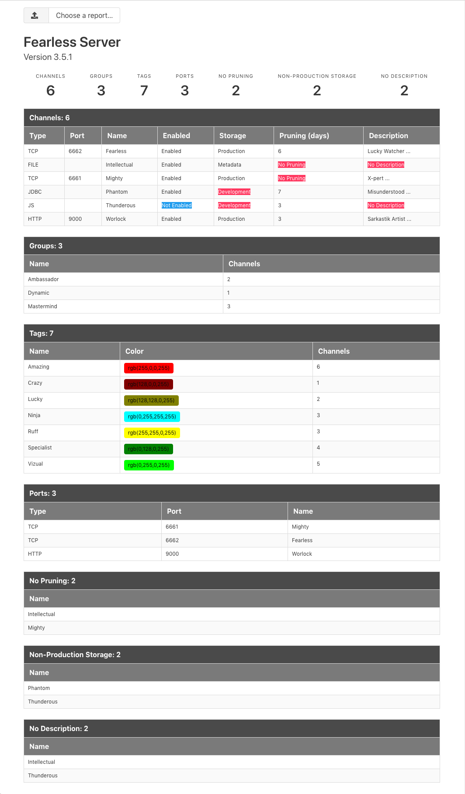
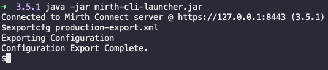
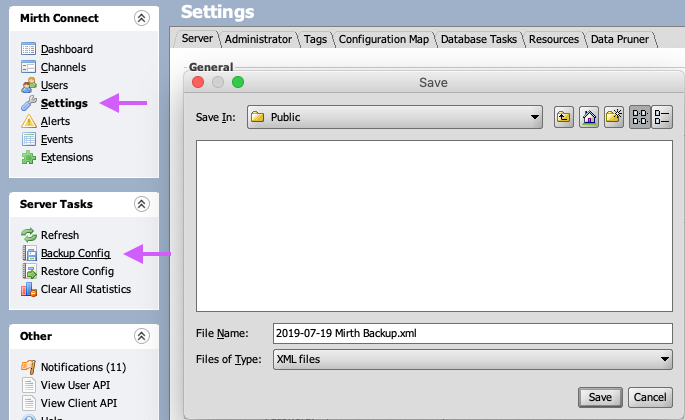

# Connect Stats
Shows current Connect inventory, using a Connect Configuration Export.

<a href="assets/images/sample-report.png"></a>

## Currently Displaying
- Channels
	- Source Data Type
	- Source Port (`HTTP and TCP as of now`)
	- Name
	- Enabled Status
	- Storage Type
	- Pruning State
	- Whether a Description is set
- Channel Groups
	- Name
	- Number of Channels
- Channel Tags
	- Name
	- Color
	- Number of Channels
- Listening Ports
	- Source Data Type
	- Source Port (`HTTP and TCP as of now`)
	- Channel Name
- No Pruning
	- Channel Name
- Non Production Storage
	- Channel Name
- No Descriptions
	- Channel Name

## Usage
Click the `Upload Icon` or `Choose a Report` input to select a Connect Configuration.

Connect Configurations can be obtained using one of the following:

### Connect Command Line Interface (CLI)
```
exportcfg PATH-TO-FILE
```



### Connect Administrator
1. Settings
2. Server Tasks
	- Backup Config



### Connect Client API
```
https://CONNECT_IP_OR_DNS:8443/api/server/configuration
```

## Depdendencies
- JavaScript
	- [Vue.js](https://vuejs.org/)
	- [lodash](https://lodash.com/)
	- [nprogress](https://github.com/rstacruz/nprogress)
- CSS
	- [Bulma](https://bulma.io/)
	- [Font Awesome](https://fontawesome.com)
